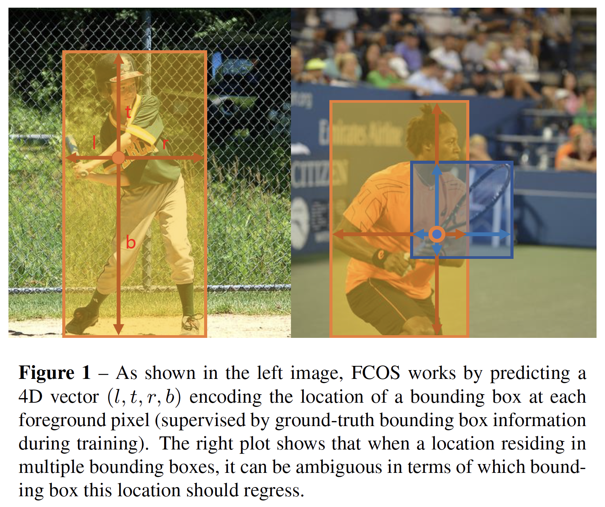
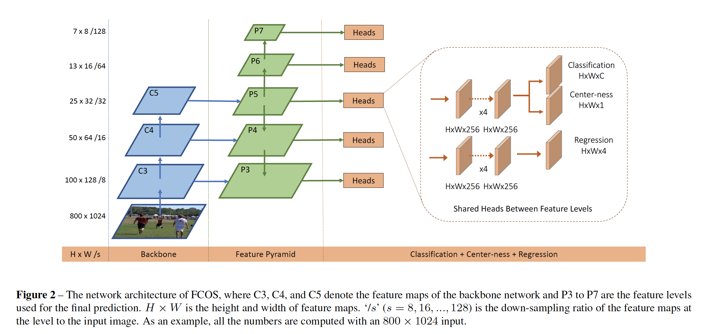
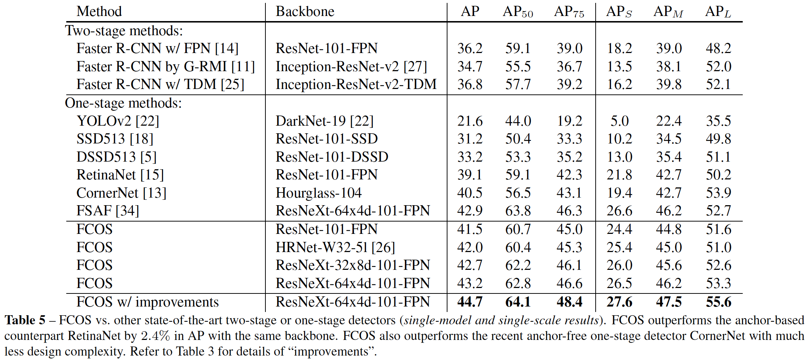

# FCOS
> **FCOS: Fully Convolutional One-Stage Object Detection**

## 简介 
这是一个 ancher free 的目标检测模型，并且第一次使得 ancher free 模型在精度上能够媲美 ancher base 的模型。虽然目前 ancher base 的目标检测模型取得了巨大的成绩，但它仍旧存在一些问题。比如：1，有很多关于 ancher box 超参数需要调节（大小, 宽高比和数量），而且超参数对不同场景敏感。 2，ancher box 数量巨大，正负样本失衡。 3，引入 IOU 等复杂的计算。

FCOS 继承 FCN 的哲学思想，每个feature上的像素点都会预测（l,t,r,b,c)，如图1和2所示。最后会通过 NMS 对预测的结果进行过滤。在我看来，这种方式之所以产生了效果，在于两点：1，增加了正样本的比重，其中每个像素点只要在 ground ture 的 box 内部，即被作为正样本。2，增加了预测的自由度，本来 ancher base 的方法只有那些在目标中心的点对检测有作用，FCOS 把这个范围扩大了，成了一个分布，基本上是距离目标中心的越远，影响越小

## 结构

## 性能

