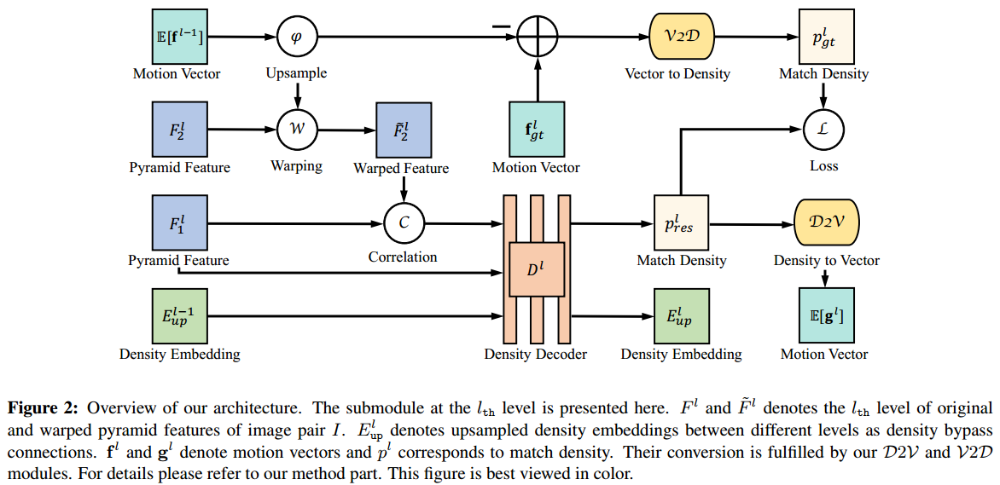
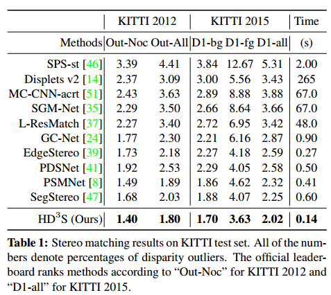
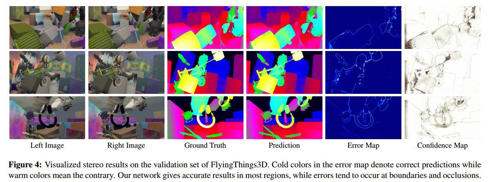

# HD3
> **Hierarchical Discrete Distribution Decomposition for Match Density Estimation**

## 简介 

这篇文章提出的模型结构适用于预测视差和光流两种任务，这里我们主要讲视差的预测。
视差的预测过程事实上就是两张图片像素点之间的匹配过程，其中像素点之间的匹配会在两张图片的同一行中进行。
通常的搜索范围是192个像素，这样的搜索其实是费时。这篇文章采用了从粗到细的预测方式(coarse to fine)，从低分辨率到高分辨率逐级微调，这也类似残差的思想。

## 结构

## 性能

